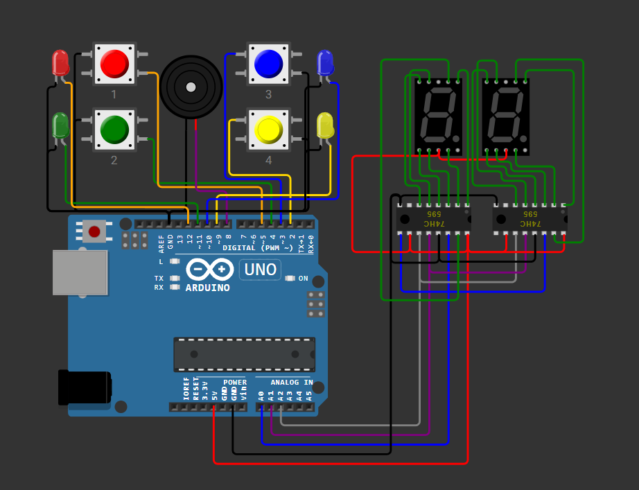

# Simon Says Game using Arduino

An electronic implementation of the classic **Simon Says** memory game built using an Arduino Uno.

The game generates a random sequence of LEDs and tones. The player must correctly repeat the sequence using the corresponding push buttons. Each successful round increases the sequence length by one. The current level is displayed on a dual 7-segment display driven using two 74HC595 shift registers.

---

## Features

- Four-button Simon Says gameplay
- Random sequence generation
- Progressive difficulty
- Individual tones for each button
- Game over animation
- Real-time score display
- Dual 7-segment display using 74HC595 shift registers
- Modular code structure

---

## Hardware Used

- Arduino Uno
- 4 LEDs
- 4 Push Buttons
- Passive Buzzer
- 2 × 74HC595 Shift Registers
- 2 × Common Anode 7-Segment Displays
- Breadboard
- Jumper Wires
- Resistors

---

## Circuit Diagram

> Replace the placeholder below with the final circuit image.



---

## 🎥 Project Demo

Watch the full demonstration here:
[Simon Says Arduino Demo](https://youtu.be/UpzkEROROMo)

---

## How It Works

1. Arduino generates a random LED sequence.
2. The LEDs and buzzer play the sequence.
3. The player repeats the sequence using the push buttons.
4. If the input matches, the sequence grows by one step.
5. If the player makes a mistake:
   - Game Over animation plays.
   - Final score remains displayed.
   - A new game starts.

---

## Project Structure

```
src/
    Simon_Says_Arduino.ino

images/
    final_circuit.png
    architecture.png
    demo.gif

docs/
    Bill_of_Materials.md
    Wiring.md

wokwi/
    diagram.json
```

## Future Improvements

- Adjustable Speed using a Potentiometer
- Rechargeable battery pack
- Enclosure
- PCB instead of breadboard
- ON/OFF power switch
- Reset push button

